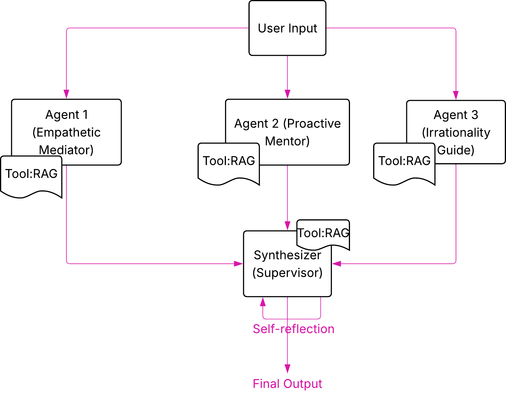

# Your Personal Therapist: Multi-Agent AI System

A Multi-Agent Support System designed to provide guidance and advice on dealing with ourselves and others. The system bridges the gap between theoretical psychology/self-help knowledge and real-life application.

## Project Aim
People often consume self-help literature but struggle to apply those principles during high-stress conflicts. This project aims to:
* Provide a space for users to share thoughts and receive non-judgmental guidance.
* Analyze conflicts through three distinct theoretical lenses simultaneously.
* Synthesize diverse perspectives into a single, coherent action plan.
* Ensure high-quality output through an automated self-reflection.

## Architecture
The system is built using a **Multi-Agent Architecture** implemented via **LangGraph**. It utilizes a "Fan-Out/Fan-In" pattern followed by a "Self-Reflection" loop.

Here is the Flow Diagram showing how the overall system work:

### Components
1.  **Parallel Expert Agents:** Three independent agents process the user scenario concurrently; each has its own persona:
    * **Empathetic Mediator:** Grounded in *Nonviolent Communication* (Marshall Rosenberg). This concentrates on understanding feelings of the user and show empathy.
    * **Proactive Mentor:** Grounded in *The 7 Habits of Highly Effective People* (Stephen Covey). This has the mindset of Inside-out growth, that we shouldn't always blame others and playing the victim, but rather being proactive, thinking win-to-win and understand others' perspectives. 
    * **Irrationality Guide:** Grounded in *Predictably Irrational* (Dan Ariely). This focuses on the hidden psychological forces and emotions that shape our behaviors and make us irrational. 

2.  **RAG Pipeline:** Each agent uses a dedicated Retrieval-Augmented Generation tool to query specific PDF versions of their respective books, ensuring advice is grounded in source material.

3.  **Synthesizer (The Supervisor):** A central node that receives the expert analyses and raw book context to craft a unified advice draft. It also has its own *RAG TOOL* to find any needed information from the three books.

4.  **Self-Reflection Loop:** The Supervisor has an iterative Actor-Critic self-reflection loop based on [this paper](https://proceedings.neurips.cc/paper_files/paper/2023/file/91edff07232fb1b55a505a9e9f6c0ff3-Paper-Conference.pdf):
  
* **The Drafter (Actor):** Ingests the initial user prompt, parallel agent analyses, and raw book passages to construct a cohesive, single-voiced advice plan. If previous iterations failed validation, it accepts a structured critique_history parameter to explicitly target and fix its past structural or tonal errors.

* **The Evaluator (Critic):** Evaluates the draft in isolation using a strict programmatic verification step. It reviews the synthesis against five criteria (Relevance, Groundedness, Integration, Actionability, and Tone Variation) and outputs its assessment (True or False) as a JSON.

If any verification parameter returns false, the graph increments the reflection_count, updates the global state with structured Feedback_Notes, and automatically routes control back to the Drafter. The loop runs recursively until all validation criteria evaluate to true or the execution hits MAX_REFLECTIONS.

6.  **Persistence Layer:** All chat histories are saved to a database, allowing for contextual multi-turn interactions between the user and the therapist.

### Architecture Diagram

### Technical Stack
* **Orchestration:** LangGraph
* **LLMs:** * **Llama 3.1 8B (Groq):** Powers the Expert Agents for high-speed, persona-strict analysis.
    * **Gemini 1.5 Flash / Pro (Google):** Powers the Supervisor for deep synthesis and massive context handling.
* **Vector Database:** FAISS (Facebook AI Similarity Search)
* **Embeddings:** HuggingFace (`all-MiniLM-L6-v2`)
* **Memory:** Chat History Database for persistent sessions.

---

## 👥 Collaborators
* **Judy Essam**
* **Laila Khaled**
* **Fatma Elsharkawy**

---
